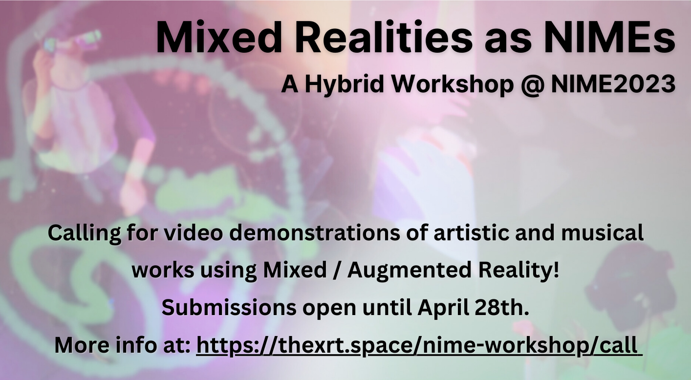

# Call for Demo Submissions 

We welcome all workshop attendees who would like to showcase their artistic and musical uses of MR/AR technology, e.g. headset, mobile, and / or projection, to submit a demonstration of their work to be included in the workshop. Feedback from other attendees (including panel speakers) will be encouraged during the discussion session.

Submission themes can include, but are not limited to, practical works engaging with mixed reality in NIME contexts of:
- Musical Composition
- Musical Notation
- Musical Performance
- Sonic Installation
- Embedded instrument systems
- Generative audio systems
- AI and ML audio systems
- Low-cost and open-source systems

To submit, please complete this [Google Form](https://docs.google.com/forms/d/e/1FAIpQLSfp53hym3dfCH-1bnk4Emy9hPla9efv2sjFgac2VkLc7BJOFA/viewform?usp=sharing), with the following information:
- Author(s) information
- Title of Demo Work
- Demo description (~500 words)
- A media link to a ~3 minute video demonstration of your work, which will be presented in the workshop (e.g. YouTube)

for more information on the Mixed Realities as NIMEs workshop, check out [this page](../nime-workshop/).

 
 

<!-- Remove link underline on image -->

  

