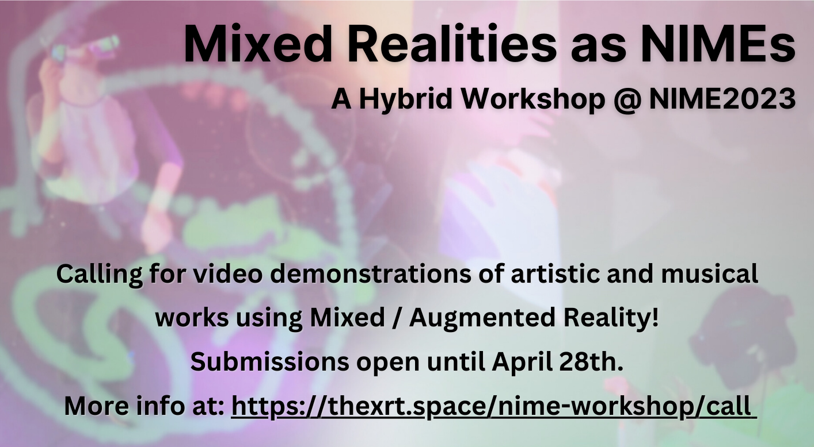

# Demo Exhibition

<iframe width="100%" height="315" src="https://www.youtube.com/embed/videoseries?list=PLA1CN3oynXG07cBNkCrDeN9ON_K4ql_AE" title="YouTube video player" frameborder="0" allow="accelerometer; autoplay; clipboard-write; encrypted-media; gyroscope; picture-in-picture; web-share" allowfullscreen></iframe>

## Netz: Two Pieces for a Novel Mixed Reality Musical Instrument
**[Max Graf](http://maxgraf.space/about/) - Doctoral Researcher, Centre for Digital Music, Queen Mary University, London, UK**

|                                  |   |
|:--------------------------------:|--|
|  | Netz, a new MRMI born from a six-month long collaboration with a pianist and music producer, with the goal of co-designing and developing a novel MRMI for performers with experience in keyboard instruments. During the design process, we investigated the use of artificial neural networks (ANNs) to facilitate nuanced control of MRMIs.    [Submission Paper](/assets/pdf/Graf%2C%202023%20-%20Netz.pdf)   [Demo Video](https://www.youtube.com/watch?v=nlKgbJVJpnk)|

## PhoeniX - Mixed Reality Performance for Dance and Viola
**[Ka Hei Cheng](https://www.kaheicheng.com/), [Dr. Jesse Allison](https://www.lsu.edu/cmda/music/people/faculty/allison.php), Avery Bergeron, Wahaj Hussein, Renzo Trinidad, Dontrell Carr, Carlos Roman, Roberto Mochetti, Irina Kruchinina - Louisiana State University, Louisiana, USA**

|                                  |   |
|:--------------------------------:|--|
|  |The PhoeniX project adopts interactive audio-visual system with mixed reality, motion tracking, music information retrieval and soundscape composition to create collaborative interactive art making immersive experience for enhancing human connection and avoid isolation. The work took reference from two artists, Robert Wechsler and Kay He.     [Submission Paper](/assets/pdf/Cheng%20et%20al.%2C%202023%20-%20PhoeniX.pdf)   [Demo Video](https://youtube.com/playlist?list=PLSJzUOg9g0APkrGsUUkBJNO2EwC6bXT1X)|

## Air Sampling - Spatial Sampler XR
**[Gregory Beller](http://www.gregbeller.com/), Jacob Sello, Georg Hajdu, Thomas Görne - Ligeti Centre, Hamburg University of Music and Theater, Hamburg, Germany**

|                                  |   |
|:--------------------------------:|--|
|  | Spatial Sampler XR is an extension of the instrument series of the [Synekine Project](http://www.gregbeller.com/2014/01/synekine-project/). In the same way that a sampler is an empty keyboard that is filled with sounds, Spatial Sampler XR uses gesture capture to transform the surrounding physical space into a key zone for indexing, placing and replaying samples. With Spatial Sampler XR, the musician spreads sound around him/her through gesture, creating a spatialized and interactive sound scene.    [Submission Paper](/assets/pdf/Beller%20et%20al.%2C%202023%20-%20Air%20Sampling.pdf)   [Demo Video](http://www.gregbeller.com/2022/06/air-sampling-002/)|

## Breath of the Forest
**[Zoe (Yi-Cheng) Lin](https://www.nagretshei.com/) - Adjunct Assistant Professor,  National Taiwan Normal University, Taipei City, Taiwan**

|                                  |   |
|:--------------------------------:|--|
|  | In this Music of the Forest Game, users will experience the forest in a whole new way. They will be transported from their location in their home behind their computer screen to the outside wilderness via 3D scenes. Instead of curated museum sounds, this experience is full of sounds inspired by nature. Users can interact with this game to create their own versions of the entire musical work and feel the breath of the forest.     [Submission Paper](/assets/pdf/Lin%2C%202023%20-%20The%20Breath%20of%20the%20Forest.pdf)   [Demo Game](https://nagretshei.itch.io/the-breath-of-the-forest)|

## Groovin' in Transcendence
**[Xiaofan (Sylvan) Shen](https://www.sylvanerd.com/) - (Director and Designer), Keerthana Sridharan, Kshitij Srivastava, Harinee Chandrasekaran - MA Student, Goldsmiths University, London, UK**

|                                  |   |
|:--------------------------------:|--|
|  | Groovin’ in Transcendence is a MOCAP-Augmented Reality (AR) project showing progressive, generative and interactive visuals on the dancing avatars that explore the idea of body forms in virtual and real spaces.    [Submission Paper](/assets/pdf/Shen%20et%20al.%2C%202023%20-%20Groovin'%20in%20Transcendence.pdf)   [Demo Video](https://youtu.be/jeySe-j3d3E)|

## polygons~ - Open-source AR software and hardware in performance
**[Sam Bilbow](https://www.sambilbow.com/) - Postdoctoral Researcher, Experimental Music Technologies Lab, University of Sussex, Brighton, UK**

|                                  |   |
|:--------------------------------:|--|
|  | polygons~ is a fifteen-minute experimental audiovisual AR improvisation using an AR performance ecosystem including three instruments: `ambi`, `click-+`, and `hands`. polygons~ was developed for a performance as part of the seventh Experimental Music Technologies (emute) Lab showcase at [The Rosehill](https://www.therosehill.co.uk/) - an independent venue, recording studio, label, creative hub, and co-working space run by artists and musicians.    [Demo Video]()|

## Cubing Sound
**[Yichen Wang](https://yichenwangs.github.io/) - PhD Candidate, Sound and Music Computing Lab, Australian National University, Canberra, Australia**

|                                  |   |
|:--------------------------------:|--|
|  |  Three interface prototypes are created for a frequency modulation synthesis system. We report on their design process and our learning and experiences through self-usage and improvisation. Our designs explore free-hand and embodied interaction in our interfaces, and we reflect on how these unique qualities of HMAR contribute to an expressive medium for sonic creation.   [Demo Video](https://www.youtube.com/watch?v=uR7LbpRMMVM)|

# Call for Demo Submissions (closed)

We welcome all workshop attendees who would like to showcase their artistic and musical uses of MR/AR technology, e.g. headset, mobile, and / or projection, to submit a demonstration of their work to be included in the workshop. Feedback from other attendees (including panel speakers) will be encouraged during the discussion session.

Submission themes can include, but are not limited to, practical works engaging with mixed reality in NIME contexts of:
- Musical Composition
- Musical Notation
- Musical Performance
- Sonic Installation
- Embedded instrument systems
- Generative audio systems
- AI and ML audio systems
- Low-cost and open-source systems

for more information on the Mixed Realities as NIMEs workshop, check out [this page](../nime-workshop/).

 
 

<!-- Remove link underline on image -->

  
   
  <a href="mailto:s.bilbow@sussex.ac.uk,yichen.wang@anu.edu.au>">Contact Workshop Organisers</a>

