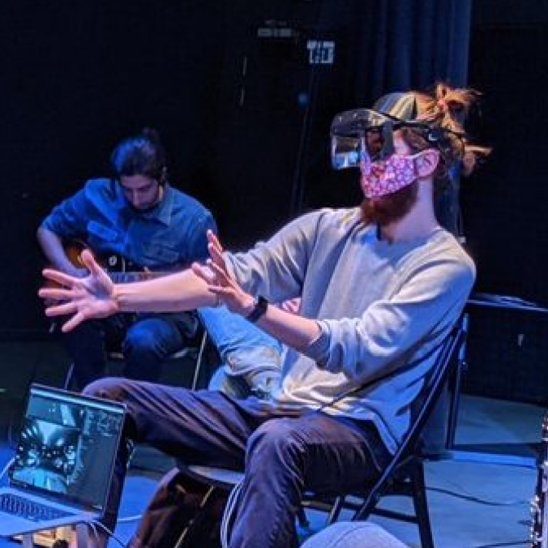
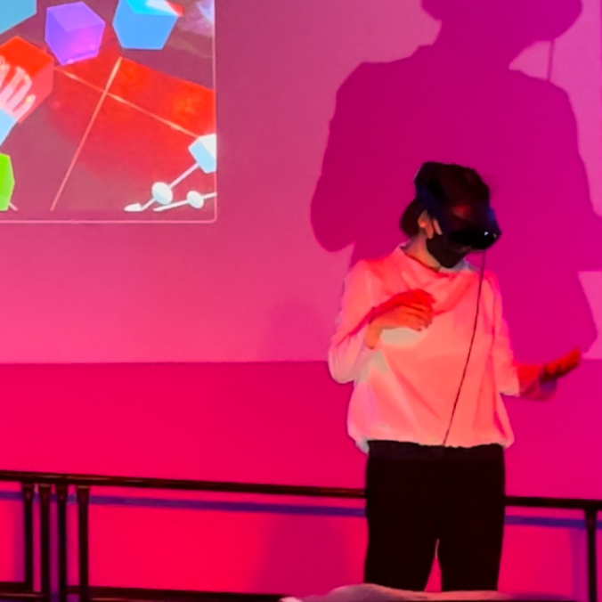
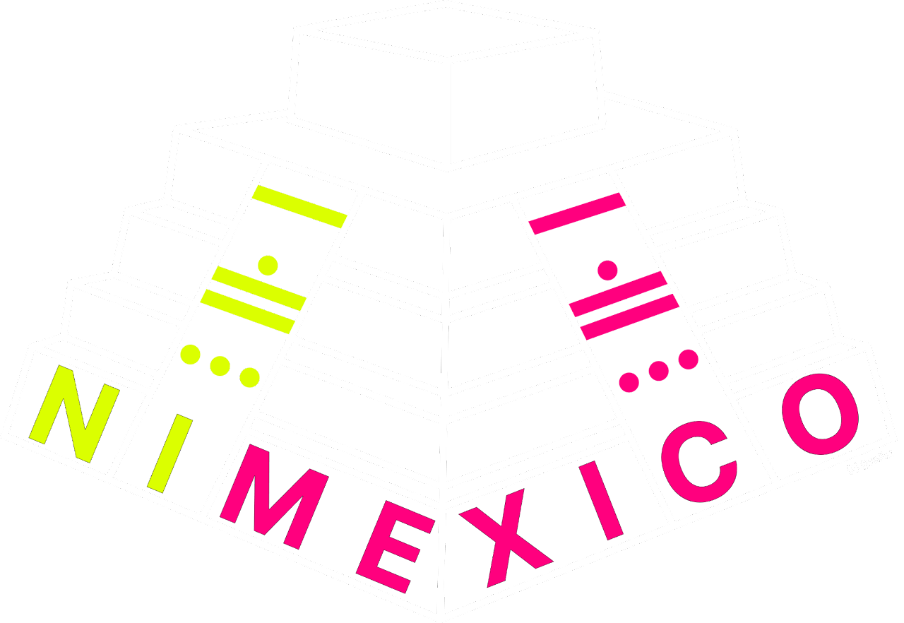

# Workshop Organisers

## Sam Bilbow
**Postdoctoral Research Fellow, Experimental Music Technologies Lab, University of Sussex**

|                                  |   |
|:--------------------------------:|--|
|  | Sam’s [research](https://sambilbow.com/) examines the intersection between musical composition and performance, and augmented reality technologies and processes from a multisensory perspective. Sam was granted a post-doctoral fellowship at the University of Sussex in 2023, examining collaborative musical experience in low-cost and open-source AR systems.  |

## Yichen Wang
**PhD Candidate, Sound, Music and Creative Computing Lab, The Australian National University**

|                                  |   |
|:--------------------------------:|--|
|  | Yichen’s [research](https://yichenwangs.github.io/) combines human-computer interaction discipline in computer science with artistic practice in new musical interface and expression design.  |

for more information on the Mixed Realities as NIMEs workshop, check out [this page](../nime-workshop/).

 
 

<!-- Remove link underline on image -->

  
   
  <a href="mailto:s.bilbow@sussex.ac.uk,yichen.wang@anu.edu.au>">Contact Workshop Organisers</a>

