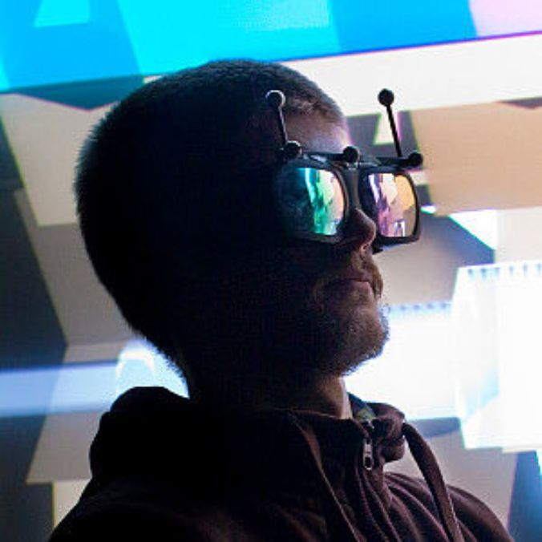

# List of Panel Speakers

We have contacted and received confirmation that the following diverse and transdisciplinary set of world-leading researchers and practitioners are able to attend (in person or online) as panel speakers: 

## Anıl Çamcı
**Assistant Professor, Performing Arts Technology, University of Michigan**

|                                  |   |
|:--------------------------------:|--|
|  | Anıl's [research](http://www-personal.umich.edu/~acamci/) deals with worldmaking across a range of media from electronic music to Virtual Reality. He investigates creativity support and music performance at the intersection of immersive media, human-computer interaction, and spatial audio. Previously, he was a Postdoctoral Research Associate at the University of Illinois Chicago's Electronic Visualization Lab, where he led research into immersive systems.   |

## Rob Hamilton 
**Associate Professor of Music and Media, Rensselaer Polytechnic Institute**

|                                  |   |
|:--------------------------------:|--|
|  | Rob's [research](https://homepages.rpi.edu/~hamilr4/) interests encompass elements of composition, electronic music, human-computer interaction, cognition, sonification, network performance, gaming and virtual reality. In short, he's interested in digging deeper into the ways in which we create, control, listen to and understand sound and music. Rob teaches courses focused on the integration of music and technology, as well as courses within the Games and Simulation Arts and Sciences (GSAS) program focused on music, gaming and simulation. |

## Cécile Chevalier
**Senior Lecturer in Media Practice, University of Sussex**

|                                  |   |
|:--------------------------------:|--|
|  | Cécile's [research](http://cecilechevalier.net/) focuses on art installations & new instruments to investigate digital culture, bodies and networked technology, their expressions, oppressions, and omissions. Drawing from an interdisciplinary practice between systems art and technology, play theory, and feminism & intersections and technology. Cécile is also co-founder of the Feminist Approaches to Computational Technology Network, and co-founder of Intersections, Feminism, Technology & Digital Humanities network.   |

## Chris Kiefer
**Senior Lecturer in Music Technology, University of Sussex**

|                                  |   |
|:--------------------------------:|--|
|  | Chris's [research](https://luuma.net/) focuses on musician-computer interaction, physical computing, and machine learning.  He performs with custom-made instruments including malleable foam interfaces, touch screen software, interactive sculptures and a modified self-resonating cello.  Chris’ research  often focuses on participatory design and development of interactive music systems in everyday settings. His work also concentrates on machine learning and signal processing for audio and interaction, with an emphasis on nonlinear and dynamical systems.   |

## Amy Brandon 
**Doctoral Researcher, Dalhousie University**

|                                  |   |
|:--------------------------------:|--|
|  | Amy's [research](https://www.amybrandon.ca/) focuses on the boundary between real and digital space, primarily through physically interactive AR sound installations. A lapsed jazz guitarist, Amy continues to research and write on guitar topics including notation, motor control, and digitally-extended instruments. She is currently completing an interdisciplinary PhD at Dalhousie University in Halifax, Nova Scotia, where she teaches composition.|

## Florent Berthaut
**Assistant Professor, Computer Science, Université de Lille**

|                                  |   |
|:--------------------------------:|--|
|  | Florent's [research](https://hitmuri.net/) explores the connections between 3D User Interfaces (in Mixed and Virtual Reality) and Musical Interaction: "In one direction, 3DUIs open many possibilities for musical expression, in particular for the manipulation of rich musical structures and the visual augmentation of musical performances. In the other direction, Musical Interaction is a rich application domain for 3DUIs, with very specific constraints which both open numerous research questions and provide interesting opportunities for interaction and visualization techniques."    |

for more information on the Mixed Realities as NIMEs workshop, check out [this page](../nime-workshop/).

 
 

<!-- Remove link underline on image -->

  
   
  <a href="mailto:s.bilbow@sussex.ac.uk,yichen.wang@anu.edu.au>">Contact Workshop Organisers</a>

